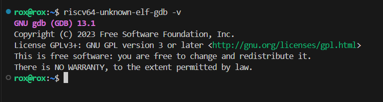
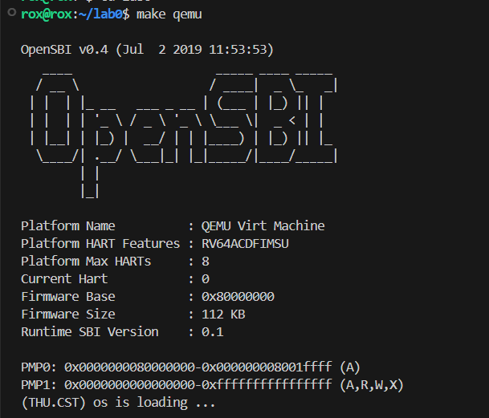
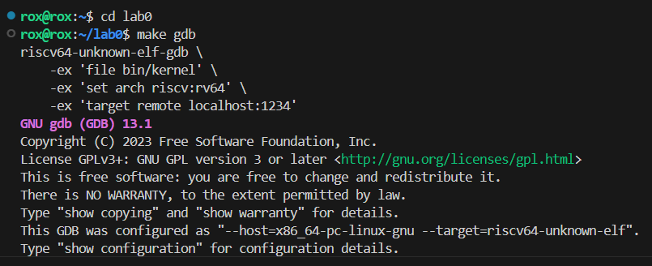
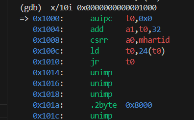
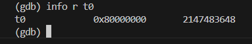
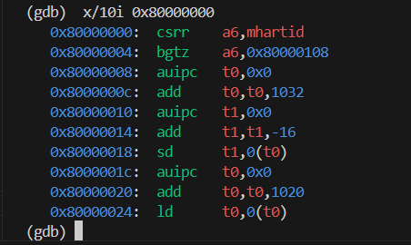
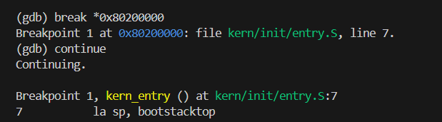

#LAB0.5实验报告
 

## 实验目的： ##
实验0.5主要讲解最小可执行内核和启动流程。我们的内核主要在 Qemu 模拟器上运行，它可以模拟一台 64 位 RISC-V 计算机。为了让我们的内核能够正确对接到 Qemu 模拟器上，需要了解 Qemu 模拟器的启动流程，还需要一些程序内存布局和编译流程（特别是链接）相关知识。

本章你将学到：

1、使用 链接脚本 描述内存布局  
2、进行 交叉编译 生成可执行文件，进而生成内核镜像  
3、使用 OpenSBI 作为 bootloader 加载内核镜像，并使用 Qemu 进行模拟  
4、使用 OpenSBI 提供的服务，在屏幕上格式化打印字符串用于以后调试

## riscv64-unknown-elf-gdb安装： ##
环境的配置在lab0中已经完成，其中qemu与交叉编译器的的配置较为简单，这里不再赘述，我简单讲一下riscv64-unknown-elf-gdb工具的配置。  

我们可以使用以下的命令行来配置riscv64-unknown-elf-gdb：
  
```sh

    wget https://mirrors.tuna.tsinghua.edu.cn/gnu/gdb/gdb-9.2.tar.xz
    tar -xvf gdb-9.2.tar.xz
    cd gdb-9.2
    mkdir gdb-build-9.2
    cd gdb-build-9.2
    ../configure --prefix=/usr/local --target=riscv64-unknown-elf --enable-tui=yes
    make
    sudo make install
 ```

对上面的指令进行一个简单的解释，首先从网络上下载 gdb-9.2-tar.gz压缩文件，之后解压缩该文件。进入到文件夹gdb-9.2，并在其中创建文件夹gdb-build-9.2，进入该文件夹配置并编译源代码，最后安装编译后的软件。

使用指令```sh riscv64-unknown-elf-gdb -v``` 检查安装是否成功，得到如下截图：

 

如上图所示，riscv64-unknown-elf-gdb下载成功！


## 实验报告要求： ##
对实验报告的要求：

基于markdown格式来完成，以文本方式为主  
填写各个基本练习中要求完成的报告内容  
列出你认为本实验中重要的知识点，以及与对应的OS原理中的知识点，并简要说明你对二者的含义，关系，差异等方面的理解（也可能出现实验中的知识点没有对应的原理知识点）  
列出你认为OS原理中很重要，但在实验中没有对应上的知识点

## 练习一： ##

为了熟悉使用qemu和gdb进行调试工作,使用gdb调试QEMU模拟的RISC-V计算机加电开始运行到执行应用程序的第一条指令（即跳转到0x80200000）这个阶段的执行过程，说明RISC-V硬件加电后的几条指令在哪里？完成了哪些功能？要求在报告中简要写出练习过程和回答。

tips:

可以使用示例代码 Makefile 中的 make debug和make gdb 指令。

一些可能用到的 gdb 指令：

``` x/10i 0x80000000``` : 显示 0x80000000 处的10条汇编指令。

``` x/10i $pc ```sh : 显示即将执行的10条汇编指令。

``` x/10xw 0x80000000 ``` : 显示 0x80000000 处的10条数据，格式为16进制32bit。

``` info register```: 显示当前所有寄存器信息。

``` info r t0```: 显示 t0 寄存器的值。

``` break funcname```: 在目标函数第一条指令处设置断点。

``` break *0x80200000```: 在 0x80200000 处设置断点。

``` continue ```: 执行直到碰到断点。

```si```: 单步执行一条汇编指令。
 
首先我们先来尝试启动一下这个内核，输入命令```make qemu```得到下面的截图：




可见内核成功启动，且正如实验指导书中所说在输出提示信息（THU.CST） os is loading...提示信息后进入死循环。


## 硬件执行流程： ##

在进行具体的分析前，我们首先来看一下riscv硬件的加电流程，首先对于本次实验中qemu所模拟的riscv硬件而言加电后的复位地址为0x0000000000001000也就是说在硬件上电后，首先会上复位地址执行相关代码进行硬件的初始化（当然还有其他功能），在完成相关的初始化后，系统会跳转到0x80000000去执行qemu自带的bootloader: OpenSBI固件，然后OpenSBI固件会继续跳转到0x80200000继续执行，这里加载着我们的操作系统的可执行程序，至此操作系统启动成功。（在 Qemu 开始执行任何指令之前，作为 bootloader 的 OpenSBI.bin 和内核镜像 os.bin已经被加载到相应的位置处）

以上便是硬件上电到操作系统启动的整个过程，下面我们将使用gdb调试程序对其中每条指令进行一个具体的分析，在命令行中输入以下两条命令已启动远程调试：

```make debug```、```make gdb```，得到截图如下，连接成功！





正如上面所说我们先来查看复位地址处的前十条指令：



```0x1000: auipc   t0,0x0```:

这条指令将当前 PC 值加上立即数 0x0 来设置寄存器 t0 的值。如果当前 PC 值是指令地址 0x1000，那么 t0 将被设置为 0x1000。

```0x1004: add   a1,t0,32```:

这条指令将 t0 的值（0x1000）加上 32，结果存入寄存器 a1。因此，a1 的值为 0x1020。

```0x1008: csrrs a0,mhartid,zero```:

这条指令从 mhartid CSR 寄存器读取硬件线程 ID 并存储到 a0 寄存器。

```0x100c: ld  t0,24(t0)```:

这条指令从内存中加载一个 64 位的值到寄存器 t0。加载的地址是 t0 寄存器的值（0x1000）加上 24，即从内存地址 0x1018 加载数据。

```0x1010:jr t0```:

这条指令，使处理器跳转去t0寄存器中的值处的地址去继续执行，我们使用指令```si```执行到```0x1000```处，键入指令 ```info r t0```查看当前t0的值，即程序要跳转的地址，如下图所示：



可见跳转时的t0值为`2147483648`经过计算验证这个值即为16进制下`0x80000000`的值，正如我们上面所说的一样，处理器在完成初始化后，会跳转到`0x80000000`运行bootloader，也就是OPENSBI固件。

使用指令``` x/10i 0x80000000```查看`0x80000000`处的10条汇编指令，得到截图如下所示：




`0x80000000: csrr a6, mhartid`：

用于从控制寄存器mhartid 中读取值到寄存器 a6 中。这条汇编指令用于获取硬件线程ID名。

`0x80000004: bgtz a6, 0x80000108`：

检查寄存器 a6 的值是否大于零，如果是，则跳转到地址 0x80000108 处继续执行。

`0x80000008: auipc t0, 0x0`：

将当前 PC 值（0x80000008）加上立即数 0x0，并将结果存储在寄存器 t0 中。

`0x8000000c: add t0, t0, 1032`：

将寄存器t0的值（0x80000008）加上 1032，结果存储回 t0。

`0x80000010: auipc t1, 0x0`

将当前 PC 值（0x80000010）加上立即数 0x0，并将结果存储在寄存器 t1 中。

`0x80000014: addi t1, t1, -16`：

将寄存器 t1 的值（0x80000010）减去-16，并将结果存储回 t1。

`0x80000018: sd t1, 0(t0)`：

将寄存器 t1 的值存储到 t0 寄存器指向的地址。

`0x8000001c: auipc t0, 0x0`：

类似于前面的指令，它将 t0 设置为0x8000001c 。

`0x80000020: add t0, t0, 1020`：

将寄存器 t0 中的值与1020 相加，并将结果存储在寄存器 t0 中。

`0x80000024: ld t0, 0(t0)`：

从 t0 寄存器指向的地址加载一个 64 位值到 t0。

以上代码主要进行硬件线程 ID 的检查，条件跳转，以及一些内存操作，包括地址计算、数据存储和加载。这些操作通常用于初始化或环境设置过程中。

可见当前代码还没有执行到操作系统内核的入口处，所以我们在gdb中键入指令：```break *0x80200000```，```continue```上面的指令在0x80200000处打了一个断点，然后一直执行到断点位置处，得到截图如下：





可见当前断点的位置正好在 kern/init/entry.S文件的第七行，指令为：```la sp, bootstacktop```这个指令用于初始化程序的栈帧。而通过实验指导手册我们知道这个文件正是操作系统内核的入口文件，与我们先前了解到的硬件加电流程一致。
