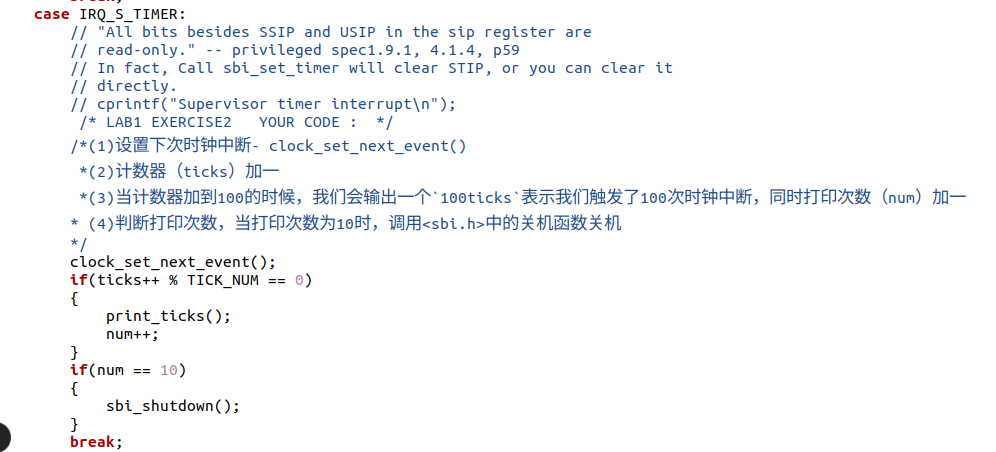
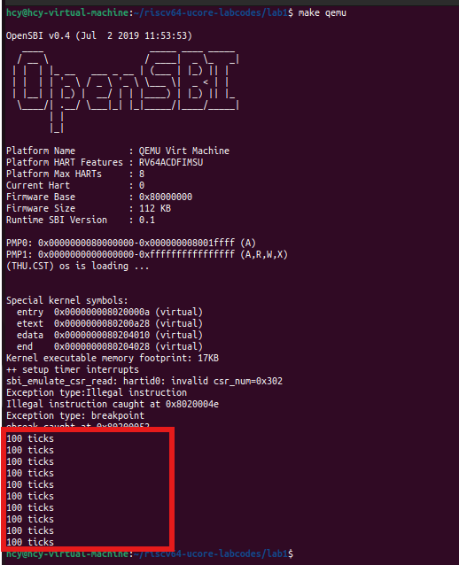
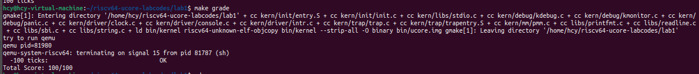
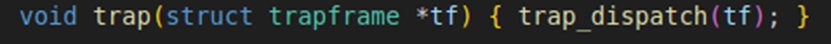
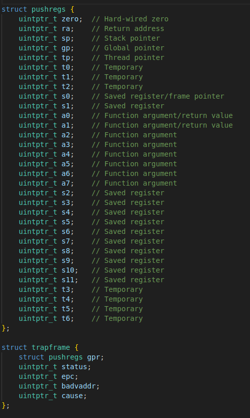
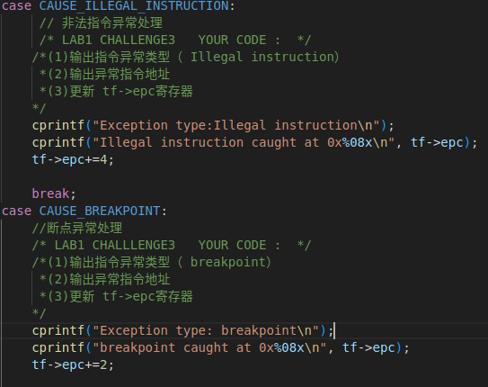
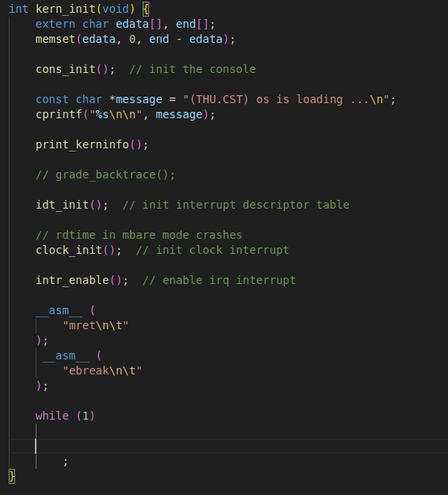
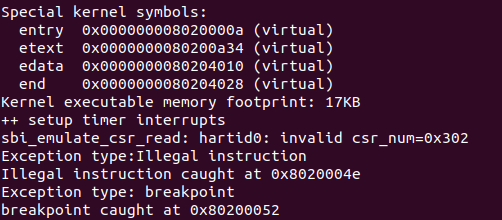

## Lab 1 练习 1：理解内核启动中的程序入口操作

> 阅读`kern/init/entry.S`内容代码，结合操作系统内核启动流程，说明指令 `la sp, bootstacktop `完成了什么操作，目的是什么？ `tail kern_init `完成了什么操作，目的是什么？

1. `la sp, bootstacktop`指令把`bootstacktop`的地址加载到寄存器`sp`中，`bootstacktop`通常是内核栈的顶部地址，通过该指令实现栈指针指向了内核的栈顶。该指令的目的是将栈指针初始化为内核栈的顶部，内核因此能够在后续的函数调用和中断处理中使用这块内存空间。在操作系统的启动过程中，栈指针的初始化是关键，因为它影响到函数调用、局部变量的存储以及中断服务例程的执行。栈指针指向的空间将用于保存调用栈的信息，包括返回地址和局部变量等。
2. `tail kern_init` 指令完成了尾调用操作，它用于跳转到 `kern_init` 函数并执行该函数。在调用`kern_init`时，由于它是尾调用，当前函数的调用上下文不再需要，因此可以直接跳转到`kern_init`而不需要保留当前函数的栈帧。这是出于性能和栈空间的考虑，因为在这种情况下，不需要保留额外的函数调用信息，因为程序已经完成了，这对于嵌入式系统或其他资源受限的环境尤为重要，因为它可以防止栈溢出，并优化内存使用。由于没有额外的栈帧，系统可以在函数调用较深时保持稳定。

## Lab 1 练习 2：完善中断处理 

> 请编程完善`trap.c`中的中断处理函数`trap`，在对时钟中断进行处理的部分填写`kern/trap/trap.c`函数中处理时钟中断的部分，使操作系统每遇到100次时钟中断后，调用`print_ticks`子程序，向屏幕上打印一行文字”100 ticks”，在打印完10行后调用`sbi.h`中的`shut_down()`函数关机。
>
> 要求完成相关函数实现，提交改进后的源代码包(可以编译执行)，并在实验报告中简要说明实现过程和定时器中断处理的流程。实现要求的部分代码后，运行整个系统，大约每1秒会输出一次”100 ticks”，输出10行。

<u>**定时器中断处理的流程：**</u>
由于OpenSBI提供的接口一次只能设置一个时钟中断事件，因此我们要在时钟中断初始化函数`clock_init()`中设置一个时钟中断，之后每次发生时钟中断的时候，在相应的中断处理函数中设置下一次的时钟中断。这种方式确保系统能够定期触发时钟中断，同时避免了同时设置多个中断事件的问题。通过在中断处理函数中动态设置下一次中断，可以实现精确的定时控制，有助于管理任务调度和其他周期性操作。这种设计在实时操作系统中尤为重要。

### (一) 初始化时钟中断

`clock_init()`用于启用时钟中断并设置第一个时钟中断： 首先，`set_csr(sie, MIP_STIP)`函数，启用了`SIE`寄存器中的时钟中断(`MIP_STIP`)，允许在S-Mode下时钟中断。然后，调用`clock_set_next_event(); `函数设置第一个时钟中断事件，确保系统在启动后能按预定的时间间隔触发时钟中断。`ticks = 0`这一行代码通常用于跟踪时钟中断的次数，可能会用于调度或其他时间管理任务。`cprintf("++ setup timer interrupts\n")` 用于输出信息，帮助开发者调试和确认时钟中断的设置过程。
```c
void clock_init(void)\{
  // enable timer interrupt in sie
  set_csrc(sie,MIP_STIP);
  // divided by 500 when using Spike(2MHz)
  // divided by 100 when using QEMU(10MHz)
  // timebase = sbi_timebase() / 500;
  clock_set_next_event();
  ticks = 0;
  cprintf("++ set up timer interrupts\n");
}
```

在`clock_set_next_event();`函数中，调用`sbi_set_timer`函数，通过传入一个时间值`time`，通常这个值是当前时间加上时间基准`timebase`时，会触发一次时间中断，这确保了下一个时钟中断将在预定的时间后触发。


- 在QEMU上，时钟的频率是10MHz，每过1s，`rdtime`返回的结果增大10000000；
- 我们设定的`timebase`为100000，因此，每次时钟中断后设置10ms后触发下一次时钟中断。

```c
void clock_set_next_event(void) { 
    sbi_set_timer(get_cycles() + timebase); 
}
```

首先分析如何获取当前时间：


根据处理器的位数（64位或32位），它会使用不同的指令来读取时间戳计数器。
`time`寄存器是一个同步计数器，从处理器上电开始运行，提供当前的实时时间。对于64位处理器，它使用`rdtime`指令直接读取64位的时间戳计数器。对于32位处理器，它使用`rdtimeh`和`rdtime`指令分别读取高32位和低32位，然后通过循环检查高32位是否发生变化，以确保读取到一个完整的64位时间戳。最后，将高32位左移32位并与低32位进行或运算，得到完整的64位时间戳。
```c
static inline uint64_t get_cycles(void) {
#if __riscv_xlen == 64
    uint64_t n;
    __asm__ __volatile__("rdtime %0" : "=r"(n));
    return n;
#else
    uint32_t lo, hi, tmp;
    __asm__ __volatile__(
        "1:\n"
        "rdtimeh %0\n"
        "rdtime %1\n"
        "rdtimeh %2\n"
        "bne %0, %2, 1b"
        : "=&r"(hi), "=&r"(lo), "=&r"(tmp));
    return ((uint64_t)hi << 32) | lo;
#endif
}

```

对于`sbi_set_timer`函数：
```c
void sbi_set_timer(unsigned long long stime_value) {
    sbi_call(SBI_SET_TIMER, stime_value, 0, 0);
}

uint64_t sbi_call(uint64_t sbi_type, uint64_t arg0, uint64_t arg1, uint64_t arg2) {
    uint64_t ret_val;
    __asm__ volatile (
        "mv x17, %[sbi_type]\n"
        "mv x10, %[arg0]\n"
        "mv x11, %[arg1]\n"
        "mv x12, %[arg2]\n"
        "ecall\n"
        "mv %[ret_val], x10"
        : [ret_val] "=r" (ret_val)
        : [sbi_type] "r" (sbi_type), [arg0] "r" (arg0), [arg1] "r" (arg1), [arg2] "r" (arg2)
        : "memory"
    );
    return ret_val;
}
```
对于第12行，S-Mode需要设置定时器时，它会执行ecall指令。这会触发一个异常，转而请求M-Mode执行特定的操作。也就是说，一旦ecall被触发，控制权转移到M-Mode，系统会根据设置的异常处理程序处理这个请求进入M-Mode的中断后，利用它的`mcall_set_timer`函数来设置定时器。

```c
static uintptr_t mcall_set_timer(uint64_t when)
{
  *HLS()->timecmp = when;
  clear_csr(mip, MIP_STIP);
  set_csr(mie, MIP_MTIP);
  return 0;
}
```

在该函数中，首先设置了定时器的触发时间。

- 我们设定`timecmp` 寄存器为当前时间`time`的值+`timebase`。`timecmp` 的值会与 `time` 寄存器进行比较。当 `time` 值变得大于 `timecmp` 时，就会产生一个定时器中断。也就是，相隔`timebase`触发一次时钟中断。

接下来，清除`mip`中对应的`STIP`位，表示这个中断已经被处理了；并为`mie`中的`MTIP`置位，让下一次时钟中断能够被触发。

### (二) 时钟中断处理

在时钟中断初始化结束后，设置了第一个时钟中断，当到达触发条件时，会触发时钟中断，进入中断处理函数。
- 通过计时器检测到时钟中断,跳转至中断向量表指向的__alltraps，然后保存上下文后跳转至trap函数。
- trap函数进一步调用trap_dispatch，然后通过cause寄存器判断为中断，进入interrupt_handler函数。
- interrupt_handler函数的第一步是调用clock_set_next_event，该函数设置下一次时钟中断的时间，随后，再次通过cause寄存器确认中断的具体原因。如果确认是时钟中断，则统计ticks。
- 在时钟中断处理中，系统会增加ticks计数，表示发生的时钟中断次数。每当ticks满足ticks % 100 == 0，系统会打印相关信息。
- 此外，系统还维护一个num计数器，用于记录连续的时钟中断次数。如果num达到10，系统则执行关机操作
- 如果在处理过程中未达到关机条件，处理程序会从trap.c返回到__alltraps，此时系统会恢复之前保存的上下文，通过sret指令，恢复到中断之前的状态，继续执行被中断的程序，直到下一次时钟中断发生。


接下来，**<u>说明中断处理具体语句的实现过程</u>**：


下面是实现的代码：

```c
case IRQ_S_TIMER:
{
	clock_set_next_event();
	static int num=0;
	if (++ticks % TICK_NUM == 0) {
        print_ticks();
        num++;
    }
	if(num == 10){
        sbi_shutdown();
    }
    break;
}
```

  

终端运行`make qemu`验证，输出10行`100 ticks`后关机：
 

  

 

终端运行`make grade`，结果如下：
  


 ## 扩展练习 Challenge1：描述与理解中断流程
1. 描述ucore中处理中断异常的流程（从异常的产生开始），其中mov a0，sp的目的是什么？

回答：目的是将经过宏定义SAVE_ALL按一定顺序压入栈的各个寄存器所构成的结构体trapframe的地址传入函数trap。其中函数trap的参数及定义如下：
按照RISC-V 的调用协议，a0为下一个调用函数的参数。而trapframe刚压入栈，即栈顶指针即为该结构体的地址。故将sp传递给a0
  
2. SAVE_ALL中寄寄存器保存在栈中的位置是什么确定的？
通过先预留结构体位置，再从栈顶向高地址找到对应位置。
保存在栈中的相对位置是根据结构trapframe中各个变量的位置决定的，其中有一个变量为gpr的结构体也按顺序在栈中排序。结构如下
  
3. 对于任何中断，__alltraps 中都需要保存所有寄存器吗？请说明理由。
首先通用寄存器保存着当前cpu运算、加载的结果，假如不保存那么先前计算或加载的结果就因可能被覆盖而不可用了；对于栈顶指针寄存器，由于该结构体的大小是确定的，可以直接由当前栈顶指针直接加36回到原来的栈顶位置；对于csr，epc记录上次中断的下一个指令位置，如果处理完中断，要返回继续执行指令则需要该寄存器的值；badaddr存储中断发生位置，需要提供发生异常的位置作为报错信息，但是要是外部中断不需要报错位置，则不一定要传报异常位置；scause存储中断原因，是必须的，因为要根据原因进行不同的处理；Sstatus保存计算机原先的状态，回复计算机时是必须的。
## 扩增练习 Challenge2：理解上下文切换机制
1. 在trapentry.S中汇编代码 csrw sscratch, sp；csrrw s0, sscratch, x0实现了什么操作，目的是什么？
对于第一条指令，由于需要将原来的栈顶指针保存又由于其他寄存器要在压栈时基于新栈顶指针寻址，所以先将栈顶指针存在sscratch这个csr里了；第二条指令是因为，csr不能直接压入栈中，需要先转移到通用寄存器，再压入栈中。
2. save all里面保存了stval scause这些csr，而在restore all里面却不还原它们？那这样store的意义何在呢？
这些寄存器是用于处理中断的，由于还原时中断已经被处理完了，这些关于中断的信息就没有作用了，于是也没必要再还原。
## 扩展练习Challenge3：完善异常中断
编程完善在触发一条非法指令异常 mret和，在 kern/trap/trap.c的异常处理函数中捕获，并对其进行处理，简单输出异常类型和异常指令触发地址，即“Illegal instruction caught at 0x(地址)”，“ebreak caught at 0x（地址）”与“Exception type:Illegal instruction"，“Exception type: breakpoint”。

对于异常处理的实现如下：
kern\trap\trap.c
  

对于检验异常处理的代码如下：
init\init.c:
  
而mret指令报错没有完成该指令，则epc没有加4到下一条指令地址所以要更新epc=epc+4；
由于ebreak指令正常运行但只有两个字节，为了对齐指令，在实现断点异常时指令地址加2。
效果如下

  


