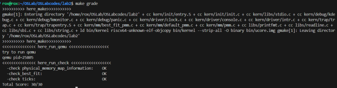

## 练习 1 ：理解first-fit 连续物理内存分配算法

> `first-fit `连续物理内存分配算法作为物理内存分配一个很基础的方法，需要同学们理解它的实现过程。请大家仔细阅读实验手册的教程并结合`kern/mm/default_pmm.c`中的相关代码，认真分析`default_init`，`default_init_memmap`，`default_alloc_pages`， `default_free_pages`等相关函数，并描述程序在进行物理内存分配的过程以及各个函数的作用。 请在实验报告中简要说明设计实现过程，并回答first fit算法是否有进一步的改进空间？
物理内存分配的整体流程可以从内核启动和初始化阶段展开。以下是更为详细的描述，涵盖了各个阶段及其实现细节。

### 一、 内核入口 (`kern_entry`)

在内核启动时，`kern_entry`函数主要负责设置虚拟内存管理。这个过程涉及到建立三级页表并将其映射到虚拟内存空间中。具体实现过程如下：

#### 1.1 分配页表空间并初始化页表

- **分配内存**：为三级页表分配`4KiB`内存，通常使用页对齐方式（12位对齐），确保内存访问的效率。
- **初始化页表项**：
  - 将前511个页表项设置为0，这意味着这些页表项未映射任何物理内存。
  - 设置最后一个页表项：为其分配物理页号 `PPN=0x8000`，并将标志位 `VRWXAD` 设为1。这表明该页表项不是一个页目录项，而是一个特定的内存区域标识。

#### 1.2 设置页基址寄存器 (`satp`)

- **计算物理地址**：取三级页表的虚拟地址的高位部分，减去虚实映射的偏移量，转换为物理地址，然后右移12位以获取物理页号。
- **设置`satp`寄存器**：将计算得到的物理页号（PPN）附加到`satp`寄存器的PPN字段，同时将MODE字段设为`SV39`，这意味着将使用SV39地址转换模式。

#### 1.3 刷新TLB（Translation Lookaside Buffer）

在更新`satp`寄存器后，需要刷新TLB以确保后续的内存访问能够正确地映射到物理内存。

### 二、内核初始化 (`kern_init`)

完成虚拟内存的设置后，内核将执行`kern_init`函数，该函数的主要任务是进行内存管理初始化和其他相关工作。

#### 调用`pmm_init`函数

在`kern_init`中，首先会调用`pmm_init`函数以初始化物理内存管理。具体步骤如下：

- **探测物理内存**：系统需要检测物理内存的大小和地址范围，了解可用的物理内存资源。通常通过读取特定的硬件寄存器或内存映射区域来获取这一信息。
- **管理物理内存**：将整个物理内存按固定页大小划分（通常为4KiB），以便在运行过程中以页面为单位进行管理。

### 三、物理内存管理初始化 (`pmm_init`)

在`pmm_init`函数中，物理内存管理的主要步骤包括：

#### 3.1 初始化物理内存管理器 (`init_pmm_manager`)

- 定义一个物理内存管理器，这个管理器将负责管理内存的分配和释放。其核心功能包括跟踪哪些内存页面被分配，哪些是空闲的。

#### 3.2 检测物理内存 (`page_init`)

- **检测内存大小**：根据探测到的物理内存信息，确定内存的总大小。
- **保留已使用的内存**：在操作系统启动时，某些内存区域可能已经被占用（例如内核、硬件设备等），因此这些内存需要被保留，不能被分配给用户进程。
- **创建空闲页面列表**：基于上述信息，创建一个空闲页面列表，方便后续内存的分配。

#### 3.3 检查分配和释放函数 (`check_alloc_page`)

- **验证内存管理功能**：通过一系列测试，确保物理内存的分配和释放函数的正确性。


### 四、定义物理内存管理器

在`init_pmm_manager`内部，首先将物理内存管理器 `pmm_manager` 的指针指向 `&default_pmm_manager`，这是一个`pmm_manager`结构体的实例，采用 `First Fit` 算法进行页面分配。所谓的 `First Fit` 算法在需要分配页面时，会从空闲页面块链表中找到第一个合适大小的空闲块并进行分配。当释放页面时，该算法会将释放的页面添加回链表，并在必要时合并相邻的空闲块，从而尽量减少内存碎片的产生。

`pmm_manager` 提供了多个接口，例如分配页面、释放页面和查看当前空闲页面数等。这些接口以函数指针的形式存在，作为 `pmm_manager` 的一部分。接下来，会将这些函数指针赋值为相应实现函数的名称。

在指定好物理内存管理器后，调用 `default_init` 函数开始进行初始化工作。此函数的主要任务是**初始化一个用于管理空闲内存块的双向链表 `free_list`，同时将记录当前空闲页面数量的无符号整型变量 `nr_free` 设置为0**。调用 `list_init(&free_list)` 时，会创建一个名为 `free_list` 的链表头，其 `next` 和 `prev` 指针均指向自己，这样就形成了一个表示空闲内存块的空链表。


```cpp

// default_init函数的实现
static void default_init(void) {
    list_init(&free_list); // 初始化管理空闲内存块的双向链表free_list
    nr_free = 0;           // 初始化当前空闲页的个数为0
}

// list_init函数的实现，初始化链表
static inline void list_init(list_entry_t *elm) {
    elm->prev = elm->next = elm; // 将链表头的prev和next指针指向自己，表示空链表
}
```


### 五、初始化页面布局
```cpp
struct Page {
    int ref;                 // 页框的引用计数
    uint64_t flags;          // 描述页框状态的标志位
    unsigned int property;   // 空闲块的数量，用于 First Fit 物理内存管理器
    list_entry_t page_link;  // 空闲链表链接
};
```
为了有效管理物理内存，我们定义了一个 `Page` 结构体，用以记录当前哪些物理页面在使用中，以及哪些物理页面是空闲的。在内存中，这些 `Page` 结构体需要放置在内核之后，这样会占用一定的内存空间。此外，用于存放这些 `Page` 结构体的物理页面和内核所占用的物理页面在后续操作中将无法再被使用。

随后，我们利用 `page_init()` 函数来确定在排除内核和 `Page` 结构体所占用的物理内存后，剩余可用的物理内存范围，以便进行后续的内存分配和管理操作。


```c
static void page_init(void) {
    va_pa_offset = PHYSICAL_MEMORY_OFFSET; // 设置虚拟地址到物理地址的偏移量
    uint64_t mem_begin = KERNEL_BEGIN_PADDR; // 获取内核开始的物理地址
    uint64_t mem_size = PHYSICAL_MEMORY_END - KERNEL_BEGIN_PADDR; // 计算可用物理内存大小
    uint64_t mem_end = PHYSICAL_MEMORY_END; // 直接硬编码取代 sbi_query_memory() 接口
    cprintf("physcial memory map:\n"); // 打印物理内存映射信息
    cprintf("  memory: 0x%016lx, [0x%016lx, 0x%016lx].\n", mem_size, mem_begin,mem_end - 1); // 显示内存大小和可用物理内存范围
    uint64_t maxpa = mem_end; // 初始化最大物理地址为内存结束地址
    if (maxpa > KERNTOP) { // 检查最大物理地址是否超过了内核顶端
        maxpa = KERNTOP; // 如果超过，限制最大物理地址为 KERNTOP
    }
    extern char end[]; // 声明外部变量 end，用于获取内核结束位置
    npage = maxpa / PGSIZE; // 计算总页数，maxpa 除以每页大小 PGSIZE
    // kernel 在 end[] 结束，pages 是剩下的页的开始
    pages = (struct Page *)ROUNDUP((void *)end, PGSIZE); // 将 end 地址向上取整到页大小的边界，作为页结构体的起始地址
    // 将前 npage - nbase 页标记为保留页
    for (size_t i = 0; i < npage - nbase; i++) {
        SetPageReserved(pages + i); // 标记每个页面为保留状态
    }
    // 计算可用的物理内存起始地址
    uintptr_t freemem = PADDR((uintptr_t)pages + sizeof(struct Page) * (npage - nbase));
    mem_begin = ROUNDUP(freemem, PGSIZE); // 将可用内存的起始地址向上取整到页边界
    mem_end = ROUNDDOWN(mem_end, PGSIZE); // 将内存结束地址向下取整到页边界
    // 如果可用内存起始地址小于内存结束地址，则初始化内存映射
    if (freemem < mem_end) {
        init_memmap(pa2page(mem_begin), (mem_end - mem_begin) / PGSIZE); // 初始化内存映射，传入空闲内存块的起始页和页数
    }
}
```
在遍历空闲链表时，需要访问链表节点所在的宿主数据结构 `page` 结构体。为此，使用了 `le2page` 宏定义，其形式为 `le2page(le, member)`：

- `le` 是指向 `page` 结构体中 `list_entry_t` 成员变量的指针，即存储在双向循环链表中的节点地址值。
- `member` 是 `page` 数据类型中包含的链表节点的成员变量，即 `page_link`。

`le2page` 的实现依赖于 `to_struct` 宏和 `offsetof` 宏。首先，`offsetof` 宏用于计算成员变量 `member` 相对于结构体类型 `page` 起始位置的偏移量。这个偏移量是一个不变的值。通过将存储在双向循环链表中的节点地址值减去这个偏移量，就可以得到对应的宿主 `page` 结构体的地址。

以下是相关宏定义的实现：

```c
// convert list entry to page将链表节点转换为页结构体的指针
#define le2page(le, member) to_struct((le), struct Page, member)
/* 返回 'member' 相对于结构体类型起始位置的偏移量 */
#define offsetof(type, member)((size_t)(&((type *)0)->member))
/* *
 * to_struct - 从指针获取结构体
 * @ptr:    一个指向成员的结构体指针
 * @type:   嵌套在其中的结构体的类型
 * @member: 结构体内的成员的名称
 * */
 //从给定的指针（指向结构体的某个成员）计算出包含该成员的完整结构体的指针
#define to_struct(ptr, type, member)((type *)((char *)(ptr) - offsetof(type, member)))
```

通过以上宏定义，我们能够有效地在链表节点与宿主结构体之间进行转换，从而便于在遍历链表时访问所需的数据。


在完成上述步骤后，我们会调用 `default_init_memmap()` 函数。`default_init_memmap()` 函数根据当前的内存状况构建空闲块列表的初始状态。它依赖于从 `page_init()` 函数传递过来的参数（即某个连续地址的空闲块的起始页地址和页数），来创建一个按地址从小到大顺序连接的连续内存空闲块的双向链表。该链表的头节点是 `free_list`，而链表项则是 `Page` 结构体中的 `base->page_link`。通过 `Page` 结构体中的 `page_link` 成员变量，我们形成了一个连续的内存空闲块列表。

具体的实现流程如下：

1. 首先检查参数 `n` 是否大于0，如果 `n` 小于或等于0，则终止操作。
2. 接着初始化这 `n` 个物理页，并逐个判断每个页是否为保留页，如果是，则终止初始化。
   - 由于相邻编号的页对应的 `Page` 结构体在内存中也是相邻的，因此我们可以将第一个空闲物理页对应的 `Page` 结构体的地址作为基址，通过基址加偏移量的方式来访问所有空闲物理页的 `Page` 结构体。
3. 然后将这些页的标志位清零，并清除引用此页的虚拟页个数。
4. 将 `base` 的连续空闲页数量设置为 `n`，并将 `base` 页面标记为空闲内存块的首个页面，同时计算空闲页的总数。
5. 最后，将这 `n` 个空闲页的首页 `base` 加入空闲链表：
   - 如果空闲链表为空，则直接将 `base` 添加到链表中。
   - 如果空闲链表非空，则需要遍历该链表，比较每个节点对应的页结构体地址，将 `base` 页地址插入到合适的位置，确保空闲链表按照地址从小到大的顺序进行排序；如果遍历到链表末尾，还需要将 `base` 添加到链表的末尾。


```cpp
static void default_init_memmap(struct Page *base, size_t n) {
    assert(n > 0); // 判断n是否大于0
    // assert的作用是先计算表达式 expression ，如果其值为假(即为0)，那么它先向stderr打印一条出错信息，然后通过调用 abort 来终止程序运行。
    struct Page *p = base; // 初始化n个连续物理页
    for (; p != base + n; p ++) {
        assert(PageReserved(p)); // 检查此页是否为保留页
        p->flags = p->property = 0; // 清0，表示该页处于未使用状态
        set_page_ref(p, 0); // 清除引用此页的虚拟页个数，表示此物理页没有被虚拟页引用
    }
    base->property = n;  // 修改base的连续空页值为n
    SetPageProperty(base);  // 将base页面标记为空闲内存块的首个页面
    nr_free += n; // 计算空闲总页数
    if (list_empty(&free_list)) {
        list_add(&free_list, &(base->page_link)); 
        // 如果空闲链表为空，直接将base添加到链表中
    } else {
        list_entry_t* le = &free_list;
        while ((le = list_next(le)) != &free_list) { // 遍历空闲链表
            struct Page* page = le2page(le, page_link); 
            // 将链表节点转换为物理页结构，这里调用了le2page函数
            if (base < page) {
                list_add_before(le, &(base->page_link)); 
                // 将base插入空闲链表，确保按地址从小到大的顺序
                break;
            } else if (list_next(le) == &free_list) {
                list_add(le, &(base->page_link)); 
                // 如果已经到达链表末尾，则将base添加到末尾
            }
        }
    }
}
```


### 六、验证分配、释放页面函数
```cpp
static void check_alloc_page(void) {
    pmm_manager->check();
    cprintf("check_alloc_page() succeeded!\n");
}
```
接下来，调用`check_alloc_page`，来验证`pmm`中分配和释放函数的正确性。它通过分配、释放页面和检查页面属性，以及验证空闲链表的状态，来确保内存管理系统的正确性和稳定性。


#### 分配空闲页


 `default_alloc_pages` 负责从空闲页面链表中分配指定数量的物理内存页面（由参数 `n` 指定）。首先，函数确保 `n` 大于 0，并检查是否有足够的空闲页面可用。如果可用页面不足，则返回 `NULL`。接着，它遍历空闲链表以找到一个能够满足需求的连续空闲页面块。如果找到合适的页面块，则在必要时对其进行分割，并更新空闲页面的数量和状态。最后，函数返回指向分配页面的指针，成功时返回所分配的页面，失败时返回 `NULL`。


```c
static struct Page *default_alloc_pages(size_t n) {
    assert(n > 0); // 判断n是否大于0
    if (n > nr_free) {  // 需要分配的页的个数大于空闲页的总数，直接返回
        return NULL;
    }
    struct Page *page = NULL;
    list_entry_t *le = &free_list; // 定义空闲链表的头部
    while ((le = list_next(le)) != &free_list) {  // 遍历整个空闲链表
        struct Page *p = le2page(le, page_link); // 转换为页结构
        if (p->property >= n) { // 找到合适的空闲页块即连续的空闲页数量大于n，可以分配
            page = p;
            break;
        }
    }
    if (page != NULL) { // 如果分配成功
        list_entry_t* prev = list_prev(&(page->page_link)); // 找到前一个页块
        list_del(&(page->page_link)); // 从free_list中删除当前页块
        if (page->property > n) {  // 如果连续页的数量大于所需要的大小，分割页
            struct Page *p = page + n;
            p->property = page->property - n; // 页的连续空间减小
            SetPageProperty(p); // 将 page+n 后的页面标记为空闲内存块的首个页面
            list_add(prev, &(p->page_link)); // 插入到原来页的位置
        }
        nr_free -= n; // 减去已经分配的页
        ClearPageProperty(page); // 清除分配空闲页首页的首个空闲页面标志
    }
    return page;
}
```

分配空闲页的具体流程如下：

- 首先检查空闲页的总数是否大于所需的页面数量 `n`。如果要分配的页面数量大于当前空闲页的数量，函数将直接返回 `NULL`，表示分配失败。
- 接着，遍历整个空闲链表。如果找到一个合适的空闲页块，即 `p->property >= n`（表示该页块的连续空闲页数量大于或等于 `n`），则可以进行分配。
  - 从空闲链表中删除该页块，并将总空闲页数减去分配的页数；同时调用 `ClearPageProperty(p)` 来重新设置分配的首页的标志位。
  - 如果当前空闲页块的大小大于所需的大小，则进行页块的分割。具体来说，在分配了 `n` 个页后，如果仍有连续的空间可用，就在最后分配的页的下一个页（未分配的页）上调用 `SetPageProperty(p)`，将其标记为连续空闲内存块的首个页面，并将其插入到分配前的位置，同时更新它的连续空闲页数值。

#### 释放页


 `default_free_pages` 负责释放指定数量的连续物理内存页面，并将其标记为可用。首先，函数确保要释放的页面数量 `n` 大于 0，并遍历从 `base` 开始的 `n` 个页面，检查它们是否已分配（通过判断 `PageReserved(p)` 和 `PageProperty(p)`）。如果某个页面已分配，则将其标志位 `flags` 清零，并将引用计数设置为 0。接着，设置 `base` 页的连续空闲页面数量 `property` 为 `n`，并标记其为空闲页面。然后更新全局空闲页面计数 `nr_free`。

接下来，函数判断空闲链表是否为空。如果为空，则直接将 `base` 加入链表；如果不为空，则遍历链表，确保将 `base` 插入到正确的位置，保持链表按地址递增排序。在此之后，函数检查 `base` 前后的相邻页块，如果相邻，则将其合并。具体而言，如果 `base` 前一个块的结束地址与 `base` 地址相同，则将前一个块的 `property` 值与 `base` 的 `property` 值相加，并更新标志位；同样地，如果 `base` 后一个块与 `base` 地址相邻，则也进行合并操作，确保空闲页块的连贯性。最终，函数完成对页面的释放和链表的更新。

```c
static void
default_free_pages(struct Page *base, size_t n) {
    assert(n > 0);
    struct Page *p = base;
    for (; p != base + n; p ++) { 
    // 从base开始遍历检查(根据物理地址的连续性)需要释放的页是否被分配，如果被分配就把flags置为0，说明已经被分配，可以被释放，把引用次数改为0；
        assert(!PageReserved(p) && !PageProperty(p));
        p->flags = 0;
        set_page_ref(p, 0);
    }
    base->property = n; // 设置连续空页大小为n
    SetPageProperty(base);
    nr_free += n; // 空闲链表数量加n

    if (list_empty(&free_list)) { // 如果空闲链表为空，直接加入base
        list_add(&free_list, &(base->page_link));
    } else {
        list_entry_t* le = &free_list; // 空闲链表头
        while ((le = list_next(le)) != &free_list) {
            struct Page* page = le2page(le, page_link); // 转换为页结构
            // 还是要确保地址从小到大的顺序
            if (base < page) { 
                list_add_before(le, &(base->page_link));
                break;
            } else if (list_next(le) == &free_list) {
                list_add(le, &(base->page_link));
            }
        }
    }
    // 获取base的前一页块
    list_entry_t* le = list_prev(&(base->page_link));
    if (le != &free_list) { // 如果不是空闲链表的头部
        p = le2page(le, page_link); // 转化为页结构
        if (p + p->property == base) { // 如果这个页块和base是地址相邻的
            p->property += base->property;
            ClearPageProperty(base); // 清除base的首空闲页标记
            list_del(&(base->page_link)); // 从空闲链表里删除base
            base = p; // 新的base
        }
    }
    // 获取base的后一页块
    le = list_next(&(base->page_link));
    if (le != &free_list) { // 如果不是空闲链表的头部
        p = le2page(le, page_link); // 转化成页结构
        if (base + base->property == p){  // 如果base+base的连续的空闲大小之后等于当前页
            base->property += p->property; // 把p合并到base
            ClearPageProperty(p);
            list_del(&(p->page_link)); // 删除p，因为空闲链表链接的是空闲页块的首页
        }
    }
}
```
### 七、优化
`First Fit`算法存在以下缺点：
（1）每次都是优先利用低址部分的空闲分区，造成低址部分产生大量的外碎片。
（2）每次都是从低址部分查找，使得查找空闲分区的开销增大；
针对首次适应算法（First Fit）的两个缺点，以下是相应的优化建议：

- 为了有效减少内存碎片，可以设定一个合并周期，例如每进行 100 次内存分配后触发一次合并操作，这样可以降低频繁合并带来的性能开销。在合并时，遍历空闲内存列表，检查相邻的空闲块，如果它们地址相邻且均为空闲状态，则将其合并为一个更大的空闲块，并更新其大小。同时，需调整相关数据结构，以确保内存管理系统准确反映当前的空闲内存状态。
- 为提高 `First Fit` 实现中的内存分配和释放效率，可以用平衡二叉树（如 Splay Tree 或 AVL Tree）替代双向链表来管理空闲块，从而将查询时间复杂度降低至 `O(log n)`。每个节点存储空闲块的起始地址和大小，以及子树中最大空闲块的大小，以便快速查找。通过二分查找策略，可以迅速定位符合条件的空闲块，并利用 Splay 操作提升后续查询的效率。这种改进不仅加快了内存管理响应速度，还减少了内存碎片，提高了内存利用率，从而显著提升了整体性能。

## 练习 2 ：实现 Best-Fit 连续物理内存分配算法（需要编程）
> 在完成练习一后，参考kern/mm/default_pmm.c对First Fit算法的实现，编程实现Best Fit页面分配算法，算法的时空复杂度不做要求，能通过测试即可。 请在实验报告中简要说明你的设计实现过程，阐述代码是如何对物理内存进行分配和释放，并回答如下问题：你的 Best-Fit 算法是否有进一步的改进空间？
<div>在这里我简单讲解一下本组本次操作系统的练习二的实现方法，由于先前我们在练习一的报告文档中已经对fitrst_fit连续物理内存分配方法进行了详细的讲解，best_fit连续物理内存分配方法是在fitrst_fit的物理内存分析方法的基础上得到的，所以在本篇报告中，我们不会对这个方法从头详细的进行讲解，只会讲解其与fitrst_fit方法所不同的地方。</div>

<div>首先对于best_fit方法所使用到的函数，除了函数best_fit_alloc_pages，其余函数均与fitrst_fit方法中的函数相同，在练习时，我们只需要参照default_pmm.c文件中有关fitrst_fit方法的代码补充我们的best_fit方法即可。</div>

<div>对于函数best_fit_alloc_pages，其代码大致如下：</div>


```c
static struct Page *best_fit_alloc_pages(size_t n) {
    assert(n > 0); // 确保请求的页面数量大于0
    if (n > nr_free) { // 如果请求的页面数量大于空闲页面总数，返回NULL
        return NULL;
    }
    struct Page *page = NULL; // 初始化分配的页面指针
    list_entry_t *le = &free_list; // 初始化链表指针，指向空闲列表的头部
    size_t min_size = nr_free + 1; // 初始化最小差值
    int min = PHYSICAL_MEMORY_END / PGSIZE; // 初始化最小差值为一个较大的值
    struct Page *best_page = NULL; // 初始化最佳页面指针
    // 遍历空闲列表，寻找最佳适配的页面
    while ((le = list_next(le)) != &free_list) {
        struct Page *p = le2page(le, page_link); // 将链表节点转换为Page结构体
        // 检查当前页面是否满足条件
        if (p->property >= n && (p->property - n) < min) {
            best_page = p; // 更新最佳页面指针
            min = (p->property - n); // 更新最小差值
        }
    }
    page = best_page; // 将最佳页面指针赋值给page
    if (page != NULL) { // 如果找到了合适的页面
        list_entry_t *prev = list_prev(&(page->page_link)); // 找到前一个页块
        list_del(&(page->page_link)); // 从空闲列表中删除当前最佳页面
        // 如果当前页面的空闲部分大于请求的数量，进行分割
        if (page->property > n) {
            struct Page *p = page + n; // 创建指针指向分割后剩余的页面
            p->property = page->property - n; // 更新剩余页面的属性
            SetPageProperty(p); // 标记新页面为可用内存块的首个页面
            list_add(prev, &(p->page_link)); // 将新页面插入回链表中
        }
        nr_free -= n; // 更新空闲页面计数，减去已分配的页面数量
        ClearPageProperty(page); // 清除分配页面的空闲标志
    }
    return page; // 返回分配的页面指针
}
```


<div>
本函数的大致实现流程同样与fitrst_fit中的函数default_alloc_pages相同，均是首先对需要得到的连续内存大小进行判断，在检验通过后会遍历整个空闲块链表，根据内存分配策略寻找到适合的空闲块，将该空闲块从空闲列表中取出，并对该空闲块中余下的部分重新串入空闲块列表。</div>

<div>
对于best_fit连续物理内存分配方法，我们的策略是寻找到与我们需要的空闲内存大小最为接近的空闲内存块作为我们使用的块，所以我根据策略要求编写代码如下：</div>

<div>
首先定义最接近于我们所需要内存大小的内存块best_page以及该内存块与目标内存大小之间的差值min：</div>

<pre><code>int min= PHYSICAL_MEMORY_END/ PGSIZE;
struct Page *best_page=NULL;</code></pre>
<div>
其中我们定义这个差值为PHYSICAL_MEMORY_END/ PGSIZE这代表着这个内存空间中的所有物理页面数量，超过这个大小的内存申请均无法通过分配连续的物理页的方法解决。</div>
<div>
接下来我们遍历当前的空闲块链表：</div>

```c
 while ((le = list_next(le)) != &free_list) {
        struct Page *p = le2page(le, page_link);
        if (p->property >= n &&(p->property-n)<min) {
            best_page = p;
            min=(p->property-n);
        }
    }
```
<div>
在遍历过程中，我们对每个空闲块的大小进行评估，最终选取超过我们需要的内存的最小空闲块作为我们的选择。</div>

<pre><code>page=best_page;
</code></pre>

<div>最终我们将找到的符合要求的空闲块赋值给先前定义的变量page用于后面将该空闲块多余部分重新串入空闲块链表。
至此，best_fit连续物理内存方法的实现结束，下面是我们进行测试所得到的截图：</div>


<div>如图所示，best_fit算法通过了系统测试。</div>

  
**针对Best-Fit 算法的改进空间，主要集中在以下几个方面：**

1. **外部碎片问题**：Best-Fit 算法容易产生小的、无法利用的内存碎片。可以采用动态碎片管理策略，根据内存的使用情况决定是否切割内存块，以减少不必要的开销。

2. **查找效率问题**：当前算法的查找复杂度为 O(n)，可以通过引入平衡树（如 splay 树）替代链表来加速查找过程。
3. **合并开销问题**：每次释放内存后都需合并相邻的空闲块，可能带来较大开销。动态合并策略可以优化合并过程，依据当前可用内存块的大小决定是否合并，这样在内存紧张时更积极地合并，以减少碎片。


