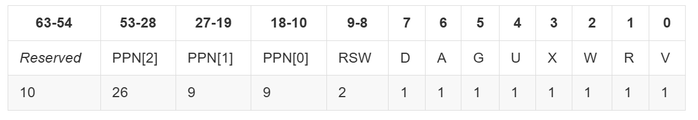

## 练习3

# 页目录项（Page Directory Entry）和页表项（Page Table Entry）中组成部分对ucore实现页替换算法的潜在用处。




sv39里面的一个页表项或页目录项大小为64位。其中63-54为保留位。第53-10位是一个物理页号，如果这是页表项则表示虚拟地址最终映射到的物理页号，如果是页目录项则为到下一层页表或者页目录的物理页号。在页替换算法中，这一项可以帮助算法根据虚拟地址找到对应的目标物理页

后面的第9-0位则描述映射的状态信息。

RSW：两位留给 S Mode 的应用程序，可以用来记录这个页表项对应物理页的所需权限。
D即 Dirty ，如果 D=1 则表示自从上次 D 被清零后，有虚拟地址通过这个页表项或页目录项进行写入。在页替换算法中，如果这个页被写入过则需要将这个页修改后的内容写入磁盘。
A即 Accessed，如果 A=1 表示自从上次 A 被清零后，有虚拟地址通过这个页表项进行读、或者写、或者取指。在页替换算法中，可以用于帮助算法基于此进行判断进而选择出更应该被换出的页。
G即 Global，如果 G=1 表示这个页表项是”全局"的，也就是所有的地址空间（所有的页表）都包含这一项
U即 user，U为 1 表示用户态 (U Mode)的程序 可以通过该页表项进映射。在用户态运行时也只能够通过 U=1 的页表项进行虚实地址映射。 注意，S Mode 不一定可以通过 U=1 的页表项进行映射。我们需要将 S Mode 的状态寄存器 sstatus 上的 SUM 位手动设置为 1 才可以做到这一点（通常情况不会把它置1）。否则通过 U=1 的页表项进行映射也会报出异常。另外，不论sstatus的SUM位如何取值，S Mode都不允许执行 U=1 的页面里包含的指令，这是出于安全的考虑。
R,W,X 为许可位，分别表示是否可读 (Readable)，可写 (Writable)，可执行 (Executable)。

# 如果ucore的缺页服务例程在执行过程中访问内存，出现了页访问异常，请问硬件要做哪些事情？数据结构Page的全局变量（其实是一个数组）的每一项与页表中的页目录项和页表项有无对应关系？如果有，其对应关系是啥？

首先基于虚拟地址，从页目录或者页表根据虚拟地址对应偏移一层一层最终找到对应的页表项，如果这个页表项标记没有对应的物理页则发生缺页异常，并调用do_pgfault为这个虚拟页映射一个物理页号。这时就需要硬件去将原来使用这个物理页的页表项的标志设置成无效。

pra_vaddr属性为该物理页当前所被映射的虚拟页号。

pra_page_link为记录当前可以用于替换的物理页，用于页的替换算法。

visited用于记录该物理页是否被访问过。

```C
//do_pgfault函数内
        if (swap_init_ok) {
            struct Page *page = NULL;
            // 你要编写的内容在这里，请基于上文说明以及下文的英文注释完成代码编写
            //(1）According to the mm AND addr, try
            //to load the content of right disk page
            //into the memory which page managed.
            swap_in(mm,addr,&page);
            //(2) According to the mm,
            //addr AND page, setup the
            //map of phy addr <--->
            //logical addr
            //建立一个Page的phy addr与线性addr la的映射，如果发生错误返回
            if(ret=page_insert(mm->pgdir,page,addr,perm)!=0)
            {
                return ret;
            }
            //(3) make the page swappable.
            swap_map_swappable(mm,addr,page,0);
            page->pra_vaddr = addr;
        } else {
            cprintf("no swap_init_ok but ptep is %x, failed\n", *ptep);
            goto failed;
        }

```


## 练习4

比较Clock页替换算法和FIFO算法的不同

置换策略：FIFO算法按照页面调入内存的顺序进行置换，而Clock算法则结合了页面访问位和FIFO队列的特点进行置换。
实现复杂度：FIFO算法实现简单，而Clock算法相对复杂一些，需要维护一个环形链表和一个访问位数组。
性能：与FIFO算法相比，Clock算法在减少缺页率和提高内存利用率方面表现更好。


